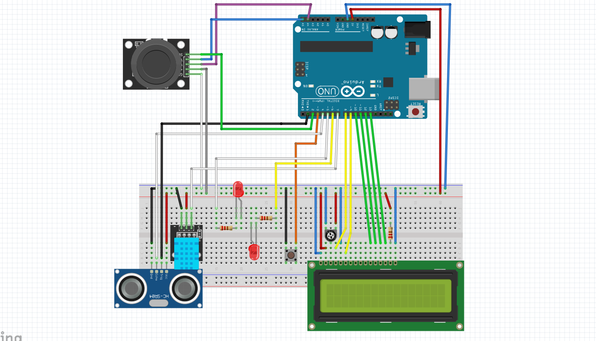

# Práctica 3

## Introducción

Para esta práctica se ha empleado el uso de Arduino Uno con los siguientes componentes:
 - Dos LEDs de distintos colores
 - Un potenciómetro
 - Un pulsador
 - Una pantalla LCD
 - Un sensor de ultrasonidos
 - Un sensor de temperatura y humedad DHT11
 - Un joystick

## Esquemático del circuito

## Explicación del código

Lo primero de todo, el método empleado para simular el paso entre distintos procesos, ha sido mediante máquina de estados. Esta máquina dispone de 12 estados:
  - ARRANQUE
  - SERVICIO_A
  - SERVICIO_B
  - MENU_CAFES
  - PREPARANDO
  - TERMINADO
  - ADMIN
  - SHOW_TEMP
  - SHOW_DIST
  - SHOW_TIME
  - MODIFY
  - MODIFYING

En cada estado se realizan distintas funciones; en algunos, como menú_cafés y admin, se mostrarán varias opciones, que se podrán elegir a través del botón del joystick.
El estado Admin solo puede ser activado mediante una pulsación de más de 5 segundos. Solo se puede acceder a los estados posteriores al Admin si se ha llevado a cabo la acción comentada previamente.

Un detalle a destacar es el uso de Else if para generar la máquina de estados. Esta implementación se ha realizado así, para poder distinguir en el código los fragmentos que pertenecen a cada estado.

Se ha hecho uso de interrupciones hardware sobre el pulsador normal y el pulsador del joystick. 
Cuando se activa cada interrupción, se guarda un registro de tiempo que servirá tanto para el control de los rebotes como para el registro del tiempo que lleva pulsado. 
El uso del registro aux_timer se emplea de manera auxiliar en procesos que requieran un determinado plazo temporal; por ejemplo, en las condiciones de cambio de estados o el movimiento entre opciones del menú (controlado por el joystick).

La interrupción del pulsador del joystick se habilita solo en estados específicos, así se evita el uso inecesario de está.

Las lecturas del joystick se han dividido en dos funciones, una por cada eje. En el eje X, se recoge el movimiento en espacios de tiempo de 500 milisegundos para hacer que el desplazamiento entre las opciones de los menús sea más suave. En el eje Y, se detectará tan solo el movimiento hacia la izquierda.

El uso de delays se ha empleado en estados en los que se necesite tomar datos o refrescar la pantalla LCD.

Las funciones implementadas se encuentran en la parte inferior del código, facilitando la visualización de este. Además, cada inicio de los estados estará indicado para poder facilitar la lectura.

## Video del funcionamiento

[Video del funcionamiento](https://urjc-my.sharepoint.com/:v:/g/personal/e_martint_2022_alumnos_urjc_es/EYSeyuBfuGNEsY5zgR_j9eoB5SzwUyYubm23snaW7nYXPQ?nav=eyJyZWZlcnJhbEluZm8iOnsicmVmZXJyYWxBcHAiOiJPbmVEcml2ZUZvckJ1c2luZXNzIiwicmVmZXJyYWxBcHBQbGF0Zm9ybSI6IldlYiIsInJlZmVycmFsTW9kZSI6InZpZXciLCJyZWZlcnJhbFZpZXciOiJNeUZpbGVzTGlua0NvcHkifX0&e=qx0gGo)

## Dificultades

Los sensores como el DHT11 son lentos en la toma de datos, por lo que en ocasiones la información no es mostrada en pantalla como debería.

La creación del estado MODIFYING fue algo complicada. La idea de modificar precios no fue complicada de programar, pero el hecho de cancelar la operación hizo que tuviera que replantear todo el estado.

